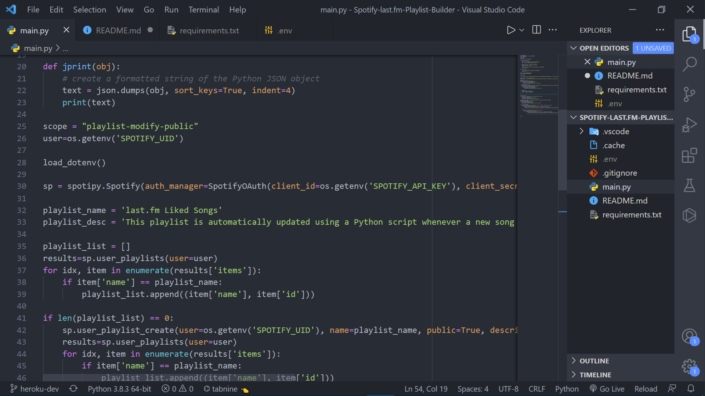

<div id="top"></div>
<h1 align="center">🎵 Spotify-last.fm Playlist Builder 🎵</h1>
</br>
<p align="center">An automatic Spotify playlist builder using last.fm Liked Songs!<p>
 
 </br>

   
## About the Project
</br>



</br>

* last.fm is a very powerful music reccommendation platform, using your past listens (scrobbles) to consistently generate music which matches those shown interests. This program was created to automatically port songs found on last.fm to a Spotify playlist, allowing the user to listen to their reccommended songs through their Spotify account.

* This program uses the user's Spotify and last.fm accounts to automatically generate and update a playlist with all songs under the user's "Liked Songs" section on last.fm. When the program is run, it searches and compiles a list of songs from the user's last.fm account. It then edits the user's corrosponding Spotify playlist with these new songs, entirely automatically with zero necessary human input

</br>

## Built With

This project was built with the following technologies:

* [Python](https://www.python.org/)
* [Spotipy](https://spotipy.readthedocs.io/en/2.19.0/)
* [last.fm Music Discovery API](https://www.last.fm/api)

<p align="right">(<a href="#top">back to top</a>)</p>

## Getting Started

To run this project locally on your own Spotify account, follow the following steps:

### Prerequisites

In order to run this Python script locally, you'll need the following dependencies installed:

```sh
pip install python-dotenv
pip install spotipy
pip install requests
```

### Installation

_In order to use this program, you will need to create a local environment variable file to store your personal API keys and User IDs. The steps to do so are shown below_
   
 1. Create a file titled ".env" in the local directory with the repository
 
 2. Paste the following into your .env file:
   ```
   SPOTIFY_API_KEY=''
   SPOTIFY_API_SECRET=''
   LASTFM_KEY=''
   LASTFM_UID=''
   SPOTIFY_UID=''
   ```
 3. Claim your free Spotify client_id and client_secret keys at [Spotify for Developers](https://developer.spotify.com/dashboard/applications)
 
 4. Claim your free last.fm key at [last.fm API](https://www.last.fm/api/account/create)
 
 5. Input above keys and account user IDs in respective fields
 
 6. You're done! Your .env file should now look like this (with the keys and IDs replaced with your values of course)
   ```
   SPOTIFY_API_KEY='###############################'
   SPOTIFY_API_SECRET='###############################'
   LASTFM_KEY='###############################'
   LASTFM_UID='pmurthy'
   SPOTIFY_UID='pmurthy20'
   ```
<p align="right">(<a href="#top">back to top</a>)</p>

## Usage

You should now be able to simply run the main program `main.py`! You will be prompted to authorize the program to modify your Spotify account on first launch, after authorizing you will see a newly generated playlist in your Spotify account with all of your last.fm songs!

<p align="right">(<a href="#top">back to top</a>)</p>

## Contact

Prathik Murthy - [LinkedIn](https://www.linkedin.com/in/prathik-murthy-a82b5b67/) - murthypr@umich.edu

<p align="right">(<a href="#top">back to top</a>)</p>
 
